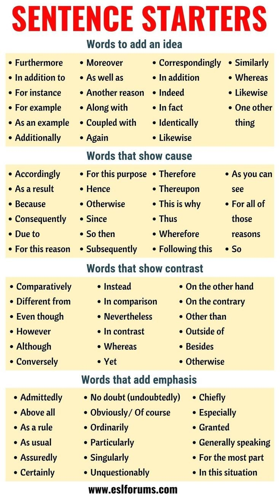

<!--
author:   Mark Jacob
email:    Mark.Jacob@iuz.tu-freiberg.de
version:  0.0.1
language: en
narrator: UK English Female

comment:  This simple description of your course.
          Multiline is also okay.

link:     https://cdn.jsdelivr.net/chartist.js/latest/chartist.min.css

script:   https://cdn.jsdelivr.net/chartist.js/latest/chartist.min.js

icon: ./img/WBM_orig_RGB.jpg

import: https://raw.githubusercontent.com/liaTemplates/TextAnalysis/main/README.md

-->

[](https://liascript.github.io/course/?https://github.com/markjjacob/UNIcertIII/blob/main/TextAnalysis.md)

# Analysis and Improvement of English

- Pair discussion: Please note down on the etherpad some points to improve in your essays

- Groupwork: analysing the essays

  - Text analysis tool (readability index etc)
  - Word Value - sentence starters/connectors
  - Students ideas from pair discussion
  - Recommendations for authors

- Authors read recommendations and modify essays

- Authors reanalyze texts

## Pair discussion:
    Pair discussion: what to look for to evaluate and improve the English essays they wrote as exam preparation

??[](https://etherpad.informatik.tu-freiberg.de/p/TextAnalysis)

## Essays

https://bildungsportal.sachsen.de/opal/auth/RepositoryEntry/32361119750/CourseNode/1655346515651983008

##    Text analysis tool (readability index etc)

``` text
Delete this and paste your text here
```
@Textanalysis.FULL

## Sentence starters/connectors



## Word Value

??[WordValue](http://www.wordvalue.gwi.uni-muenchen.de/home)

## Keys

./keys_1.csv