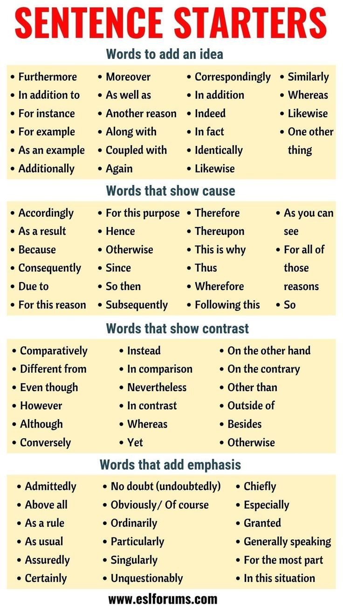

<!--

author:   Dr. Mark Jacob, Maximilian Dörnbrack
email:
version:  0.0.1
language: de
narrator: UK English Female
comment: Second hybrid lesson
icon: ./img/TUBAF_Logo_orig_RGB.jpg

-->

# Our second hybrid lesson

## Writing

{{0-3}}

{{1-3}}
**Were you good at writing at school?**

{{2-3}}
[(Yes)] Yes
[(No)] No
[(Maybe)] Maybe  

{{3-6}}

{{4-6}}
**Will you need to be good at writing in your job?**

{{5-6}}
[(Yes)] Yes
[(No)] No
[(Maybe)] Maybe

## What do students on your degree course need to be able to write?

{{1}}
??[etherpad](https://pad.riseup.net/p/WtuRbWQspF61kkgNPkEX-keep)

## Stuff from opal

??[opal](https://bildungsportal.sachsen.de/opal/auth/RepositoryEntry/32361119750/CourseNode/1631673019792429011)

## sentence starters

